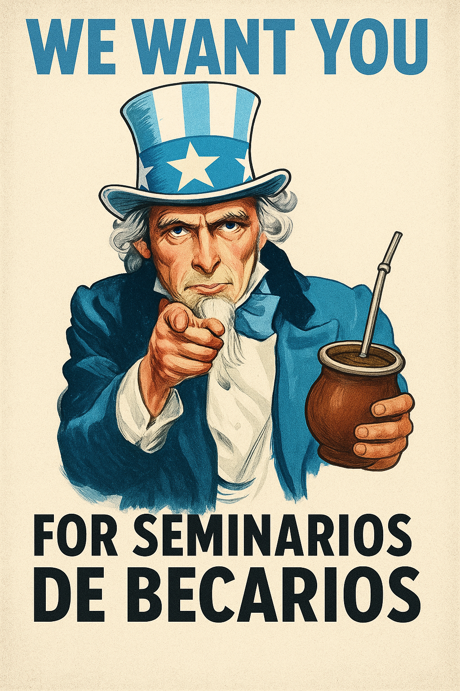

Los seminarios de la 324 son un acto de resistencia contra la soledad del paper. Estos seminarios son tu espacio y tu oportunidad para tener tu [Warhol](https://www.sciencelearn.org.nz/resources/1857-measurements-weird-and-wonderful) de fama académica, bajo la única condición de que lo que tengas para decir salga de tu corazón.

Convocamos a los becarios y becarias de todos los grupos e institutos de FAMAF-y a cualquier otro que se atreva a cruzar la puerta- para compartir un espacio en el que todos tengamos la oportunidad de contar lo que hacemos, lo que nos interesa, y lo que nos apasiona.

Quienes organizamos esto formamos parte del grupo de becarios de la oficina 324 de la FAMAF en la Universidad Nacional de Córdoba.

{fig-align="center" width="400"}