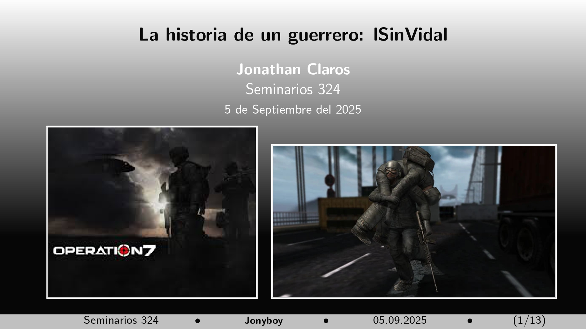
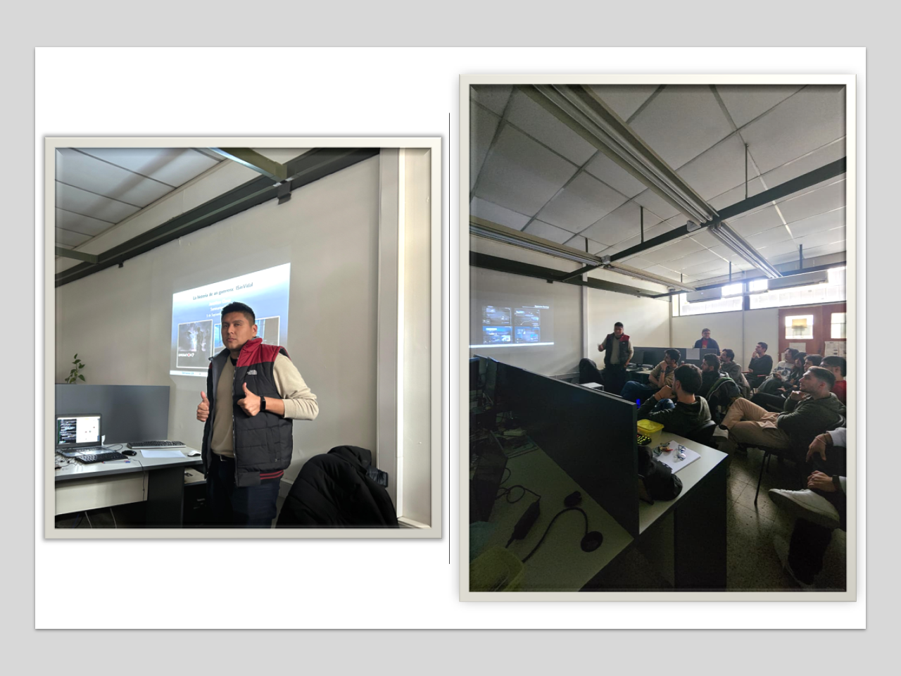

{fig-align="center" width="800"}

## Resumen

Esta es la historia de un militar que, cansado de tanta maldad, encontró un refugio. En su camino, se enfrentó a las potencias mundiales que dominaban la época, encontrando aliados en un grupo que compartía sus ideales. Así, pudo transmitir su sabiduría y eventualmente, asumir el liderazgo. Tras tres años intensos y decisivos, comprendió que su ciclo en esta vida difícil había llegado a su fin. Esta es la biografía de lSinVidal (2011-2014).

👉Link a la presentación [aquí](../../assets/posts/slides/lsinvidal.pdf)

## Datos

**Hora:** 14:00 hrs

**Lugar:** Oficina 324, FAMAF

_Seminario #2_

## El evento

