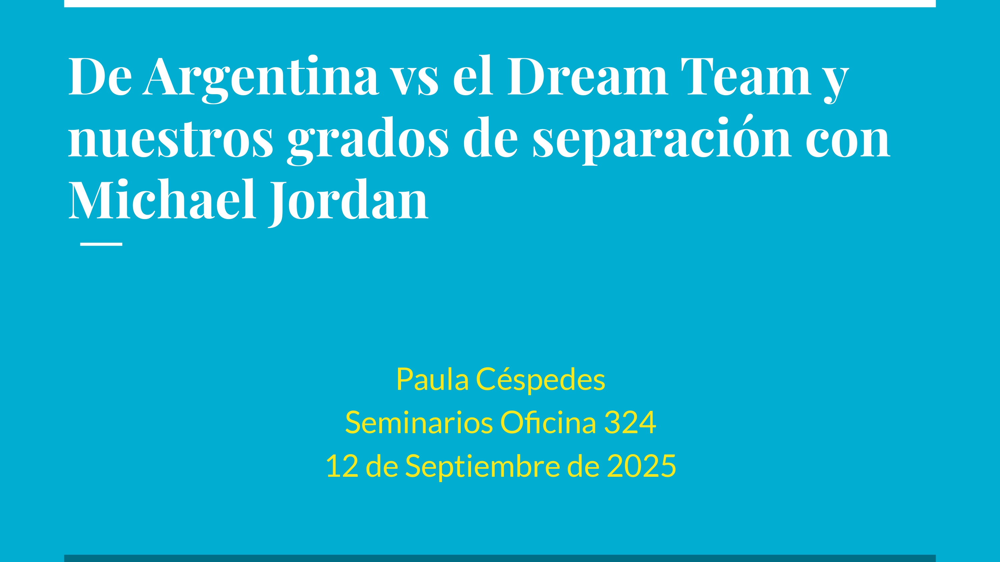
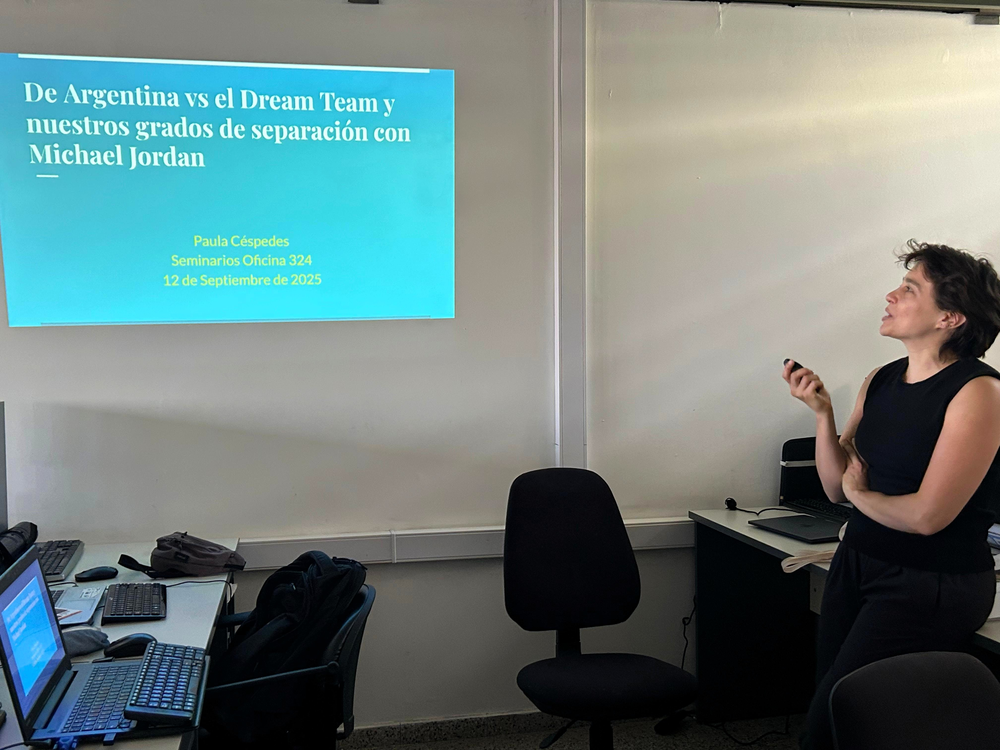

{fig-align="center" width="800"}

## Resumen

En este seminario recordaremos el mítico enfrentamiento de la Selección Argentina de Básquet vs el Dream Team de Estados Unidos en el Preolímpico de 1992 y charlaremos brevemente de lo que significó el Oro Olímpico de Argentina en Atenas 2004. Descubriremos también cuántos grados de separación o handshakes nos distancian de Michael Jordan y otras estrellas del básquet.

👉Link a la presentación [aquí](../../assets/posts/slides/basket_dreamTeam.pdf).

## Datos

**Hora:** 14:00 hrs

**Lugar:** Oficina 324, FAMAF

_Seminario #3_

## El evento

