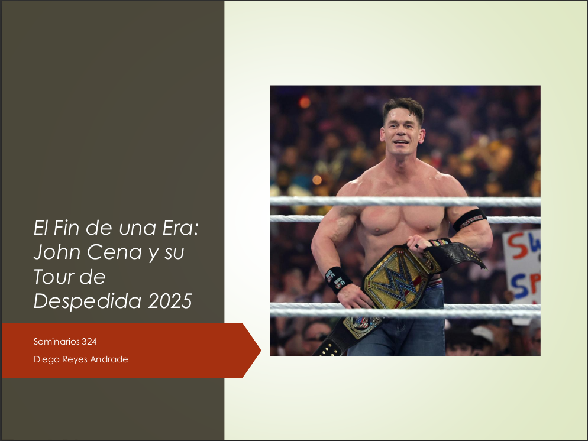
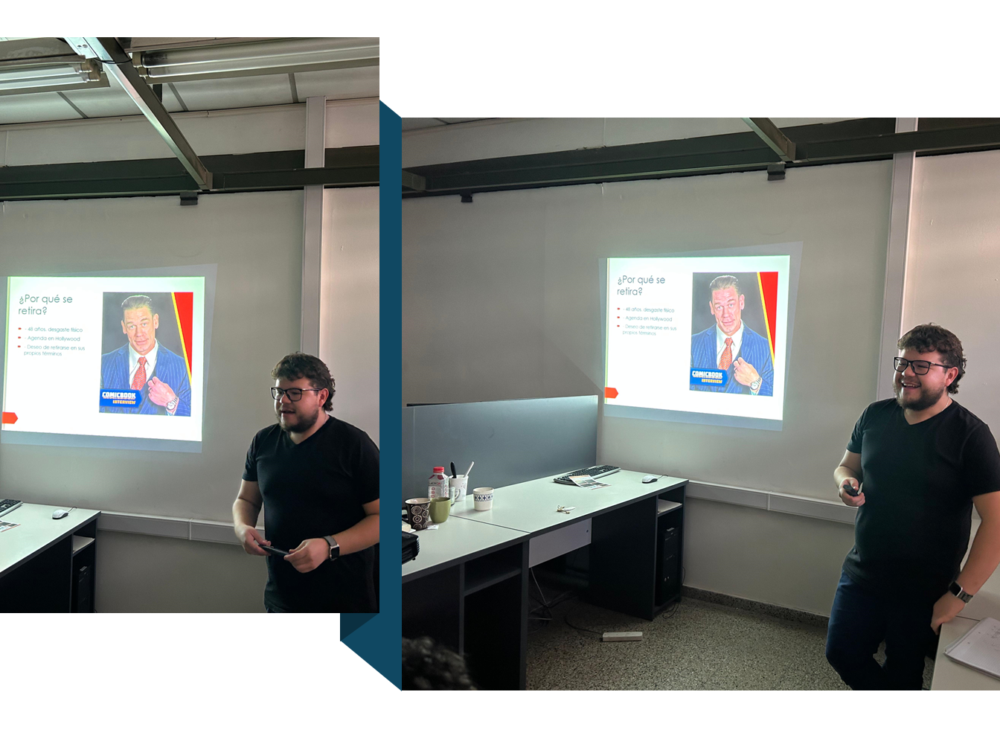

{fig-align="center" width="800"}

## Resumen

En julio de 2024, John Cena anunció su retiro de la lucha libre profesional para 2025. En esta charla analizaremos el legado de una de las figuras más icónicas de WWE, quien durante más de dos décadas marcó una era completa del entretenimiento deportivo.

Exploraremos su tour de despedida y cómo sus 17 campeonatos mundiales, su transición a Hollywood y su impacto cultural trascienden la lucha libre.

👉Link a la presentación [aquí](../../assets/posts/slides/Retiro_John_Cena.pdf).

## Datos

**Hora:** 14:30 hrs

**Lugar:** Oficina 324, FAMAF

_Seminario #4_

## El evento

{fig-align="center"}