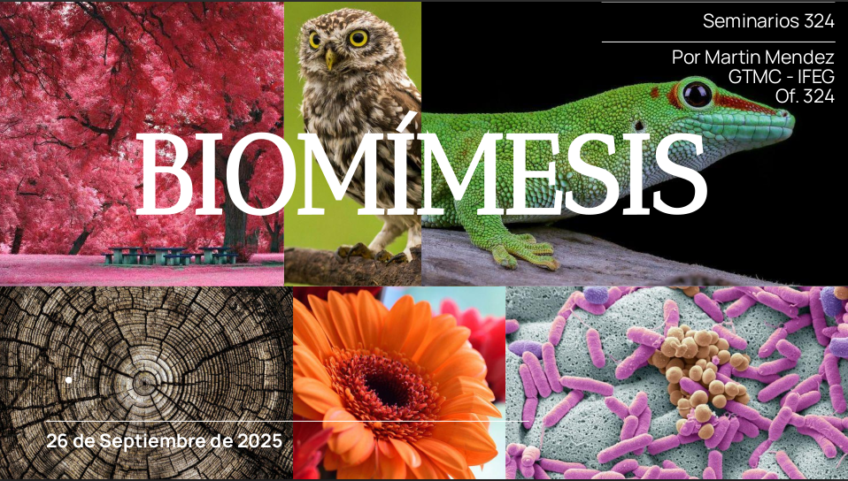

{fig-align="center" width="800"}

## Resumen

Me fascina cómo lo más complejo suele tener una explicación sencilla y elegante. Y la naturaleza es experta en eso. En esta charla, les muestro unos ejemplos que me vuelan la cabeza: algoritmos en ranas, materiales en arañas... No es biología, es buena física. Quizás, la próxima gran idea no esté en un paper, sino en observar el mundo con nuevos ojos.

👉Link a la presentación [aquí](../../assets/posts/slides/Imitar_la_forma.pdf).

## Notas del orador

👉Link a las notas [aquí](../../assets/posts/notes/mendez_Biomimesis.pdf).

## Datos

**Hora:** 14:00 hrs

**Lugar:** Aula 32, FAMAF

_Seminario #5_

## El evento

{width="1066"} {width="1066"}