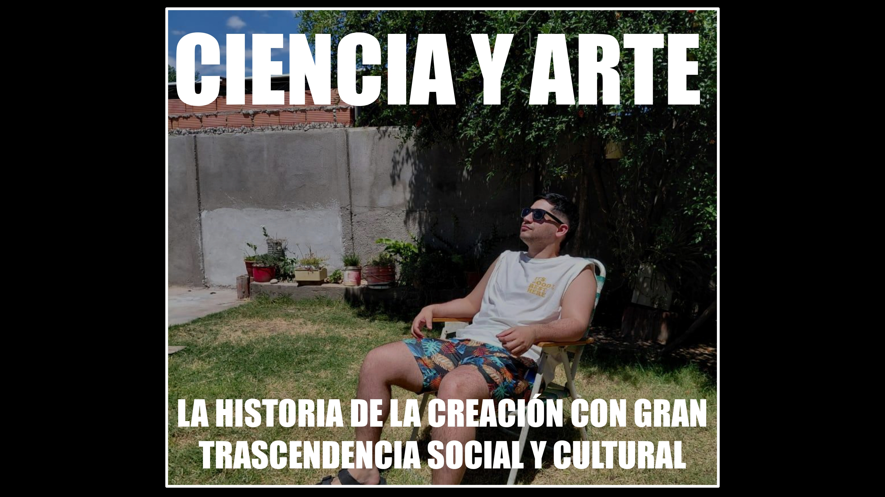
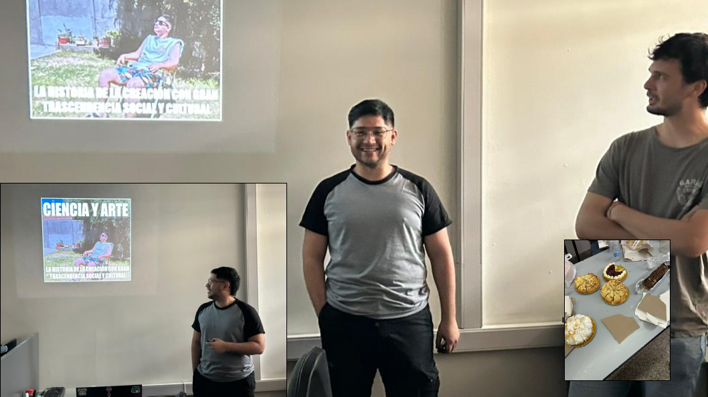

{fig-align="center" width="894"}

## Resumen

En esta charla, vamos a explorar eventos históricos cruciales que moldearon una de las mejores creaciones de la humanidad. Toda gran obra tuvo sus pros y contras: desde desapariciones, una carrera de experimentos científicos, robos de propiedad intelectual, y hasta una guerra por derechos de autor. Sin embargo, también hubo quienes entregaron alma y cuerpo para que hoy podamos disfrutar de la combinación que nos entrega la ciencia y el arte.

👉Link a la presentación [aquí](../../assets/posts/slides/ciencia_y_arte.pdf).

## Datos

**Hora:** 14:00 hrs

**Lugar:** Oficina 324, FAMAF

_Seminario #8_

## El evento

{fig-align="center" width="667"}

{fig-align="center" width="894"}