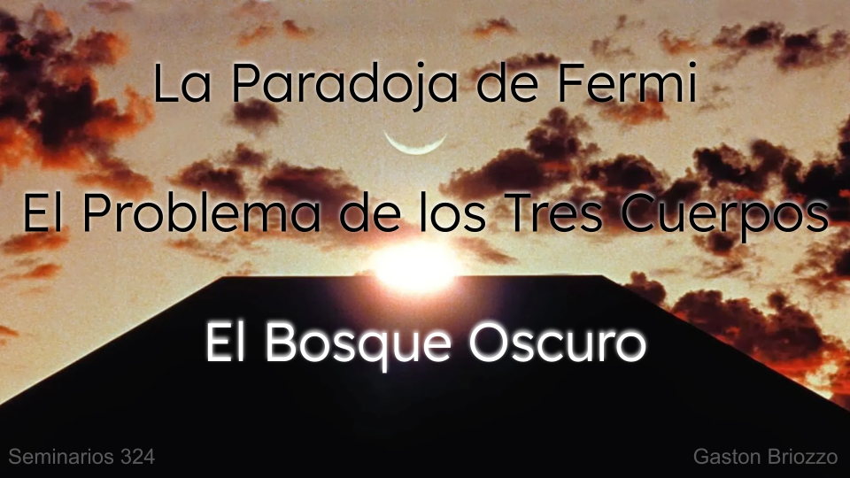
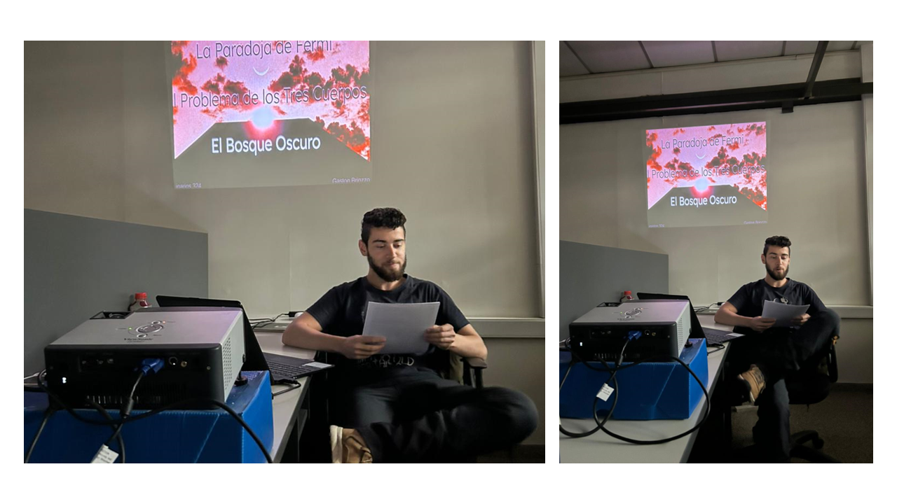

{fig-align="center" width="894"}

## Resumen

Te despiertas en una oscura espesura, un denso bosque lleno de arboles, arbustos y malezas. El aire es denso, inmóvil. La quietud del lugar te impacienta. No ves ni un solo nido de aves en el follaje de los árboles. Los frutos de los arbustos se pudre en el suelo, ningún animal que los aproveche. Un bosque que debería estar lleno de vida, parece inerte, vacío.

👉Link a la presentación [aquí](https://docs.google.com/presentation/d/14_hrzsetxdgBm0zAUGtZrdbJrWy53gprOxUlpwEfuQk/edit?usp=sharing)

## Datos

**Hora:** 14:00 hrs

**Lugar:** Oficina 324, FAMAF

_Seminario #9_

## El evento

{fig-align="center" width="667"}