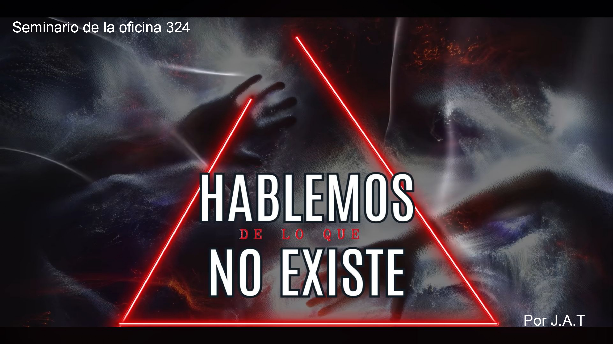

{fig-align="center" width="894"}

## Resumen

¿En esta entrega pretendo contarles acerca de aquellas cosas que "no existen", pero que aún así penetran en lo más profundo de mi psiquis y dan lugar a largas noches de desvelo. <em> Hablemos de lo que no existe </em> es el lugar donde lo que no existe, existe. Allí donde distintas historias aterradoras confluyen y erizan la piel de aquellos que osan escucharlas. Allí donde todo carece de explicación lógica y por ende, no puede ser controlado. Allí donde entendemos que aquello que más tememos, puede estar al acecho. 

👉Link a la presentación [aquí](../../assets/posts/slides/Hablemos-de-lo-que-no-existe.pdf).

## Datos

**Hora:** 14:00 hrs

**Lugar:** Oficina 324, FAMAF

_Seminario #11_

## El evento

{fig-align="center" width="600"}